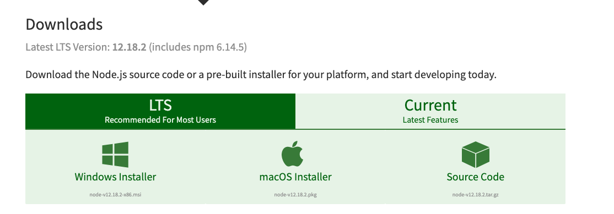
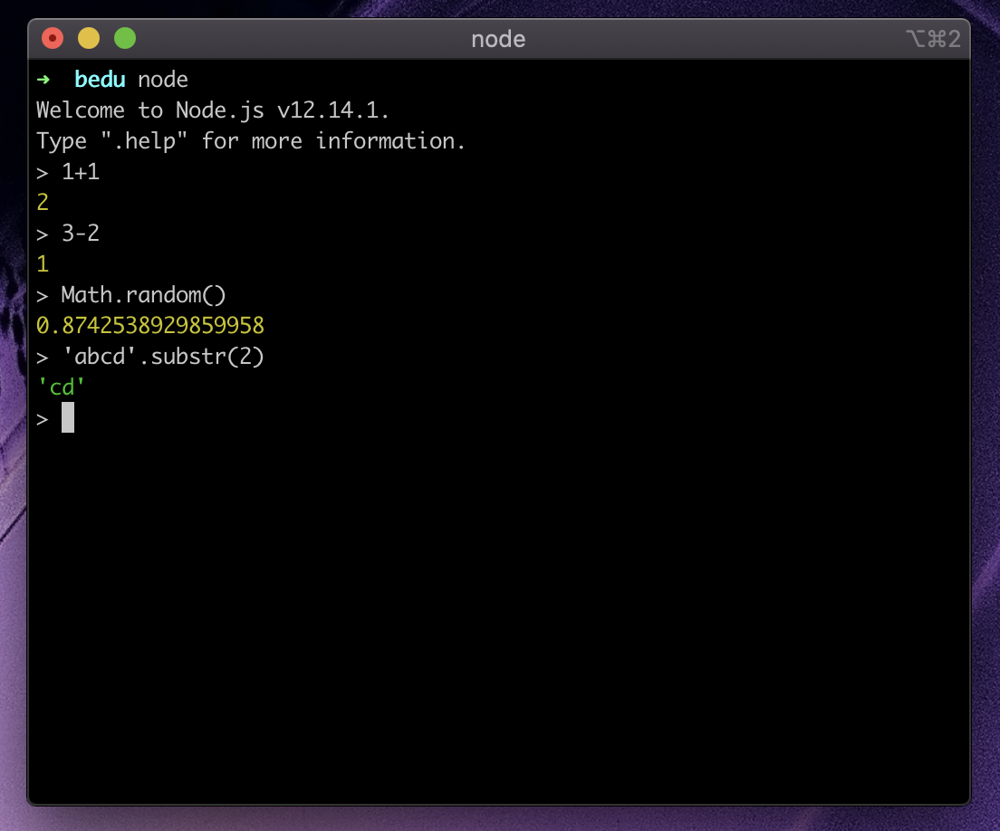

# Ejemplo 1

## Objetivo

Descargar e instalar la versión recomendada de Nodejs para tu sistema operativo.

## Requerimientos

Almacenamiento suficiente y conexión a internet para instalar Nodejs.

## Desarrollo

Para descargar la versión LTS de Nodejs ingresa al siguiente link [https://nodejs.org/en/download/](https://nodejs.org/en/download/) verás algo como esto:



Sigue los siguientes pasos para instalar Nodejs de acuerdo a tu sistema operativo:

### Windows:

1. Dar click en la versión **LTS** de Nodejs.
2. Seleccionar **Windows Installer**, esto descargará automaticamente un archivo con extensión (**.msi**).
3. Abrir y ejecutar el archivo descargado.
4. Seguir los pasos de instalación y configurar las preferencias de instalación.
5. Abrir una linea de comandos de Windows y ejecutar "node"

    ```bash
    node
    ```

## MacOs

### Sitio oficial:

1. Dar click en la versión **LTS** de Nodejs.
2. Seleccionar **macOs Installer**, esto descargará automaticamente un archivo con extensión (**.pkg**).
3. Abrir y ejecutar el archivo descargado.
4. Seguir los pasos de instalación y configurar las preferencias de instalación
5. Abrir una terminal y ejecutar

    ```bash
    node --version
    ```

### Homebrew

Requerimientos: Tener instalado Homebrew con la última versión en el siguiente link puedes obtener información de instalación [https://brew.sh/index_es](https://brew.sh/index_es)

1. Abrir una terminal.
2. Ejecutar el siguiente comando 

    ```bash
    brew install node
    ```

3. Comprobar la instalación:

    ```bash
    node --version
    ```

## Ubuntu

### Usando apt

1. Actualizar apt

    ```bash
    sudo apt update
    ```

2. Instalar Nodejs desde los repositorios:

    ```bash
    sudo apt install nodejs
    ```

3. Instalar npm

    ```bash
    sudo apt install npm
    ```

4. Comprobar la instalación

    ```bash
    nodejs -v
    ```

### Utilizando el modo REPL

El modo REPL significa Read-Eval-Print-Loop, al entrar a este modo en Node.js, en este bucle el intérprete de javascript leerá las líneas que ingresemos, evaluará las expresiones resultantes e imprimirá los resultados.

1. Ejecuta el comando `node` en tu terminal
2. ingresa expresiones en javascript y observa lo que sucede



## Instalación de Nodejs con NVM

1. Abrir el siguiente link [https://github.com/nvm-sh/nvm](https://github.com/nvm-sh/nvm) para conocer el proyecto nvm
2. Instalar **nvm**, copiar y ejecutar en una terminal el comando **wget** o **curl**:

    ```bash
    curl -o- https://raw.githubusercontent.com/nvm-sh/nvm/v0.35.3/install.sh | bash
    ```

    o

    ```bash
    wget -qO- https://raw.githubusercontent.com/nvm-sh/nvm/v0.35.3/install.sh | bash
    ```

3. Exportar el path de instalación al **bash** para cargar nvm, agregar a nuestro archivo:

    ```bash
    export NVM_DIR="$HOME/.nvm"
    [ -s "$NVM_DIR/nvm.sh" ] && \. "$NVM_DIR/nvm.sh"  # This loads nvm
    [ -s "$NVM_DIR/bash_completion" ] && \. "$NVM_DIR/bash_completion"  # This loads nvm bash_completion
    ```

4. Verificar la instalación:

    ```bash
    command -v nvm
    ```

5. Descargar, compilar e instalar nodejs:

    ```bash
    nvm install node
    ```

6. Verificar la instalación:

    ```bash
    nvm run node --version
    ```

Nota: La instalación de Nodejs con NVM sólo es para usuarios con sistema operativo Linux y MacOs