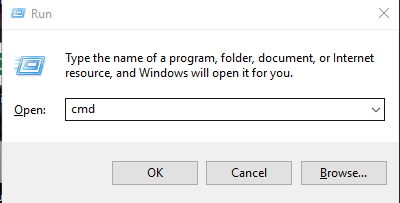
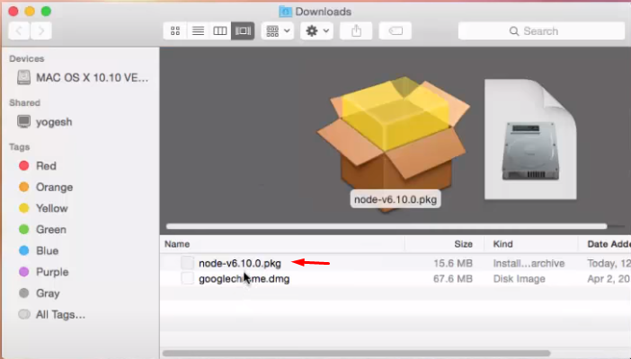

# Ejemplo 1

## Objetivo

Descargar e instalar la versión recomendada de Nodejs para tu sistema operativo.

## Requerimientos


- Sistemas operativos soportados: Windows, Mac OS X, Linux, Solaris, FreeBSD, OpenBSD, webOS  
- Conexión a Internet


## Desarrollo

Node.js es un run time (entorno de ejecución) , esto significa que node.js requiere ciertos elementos para poder ejecutarse, a continuación, te damos ejemplos de como se puede realizar la instalación de estos.

# Windows: 


### PASO 1 :   

Entra en el siguiente [link](https://nodejs.org/en/download/)

Te llevara a la sección de descargas de Node.js, una vez ahí seleccionaras la parte marcada con la flecha roja “Instalador de Windows”. 


Al hacer esto, descargara el paquete de instalación en tu computadora.


### PASO 2 :   

Ejecuta el programa de instalación, a partir de este punto darás todo en NEXT o siguiente, no te preocupes por los detalles de la instalación, cuando seas más experimentado podrás personalizarla.

### PASO 3 :   

Una vez realizada la instalación podremos probar un comando para ver si se ha concretado con éxito.

Para ello vamos a abrir la terminal, presionamos las teclas WINDOWS + R para que aparezca nuestra tarea de ejecución y escribimos en ella cmd.



Se abrirá nuestra terminal donde podremos escribir el siguiente comando y damos enter : 
   
    node --version

y nos deberá regresar la versión de nuestro Node.js que acabamos de instalar.

 <h2> Si tienes dudas, este video nos muestra comó realizar la instalación, paso por paso. 🔥</h2>     

[](https://www.youtube.com/watch?v=R8moDDltHNk)

# MacOS  

### PASO 1 : 
Entra en el siguiente [link](https://nodejs.org/en/download/)


Te llevara a la sección de descargas de Node.js, una vez ahí seleccionaras la parte marcada con la flecha roja “Instalador de MacOS. 


En la sección de descargas encontrarás un paquete con extención pkg.



### PASO 2 :

Ejecuta el programa de instalación, a partir de este punto darás todo en NEXT o siguiente, no te preocupes por los detalles de la instalación, cuando seas más experimentado podrás personalizarla.

### PASO 3 :

Una vez terminada la instalación abriremos una terminal en nuestra mac. y ejecutaremos el siguiente comando : 


    node -v
    
    
y nos deberá regresar la versión de nuestro Node.js que acabamos de instalar.

<h2> Si tienes dudas, este video nos muestra como realizar la instalación, paso por paso.🔥 </h2>    

[](https://www.youtube.com/watch?v=TQks1p7xjdI)

# Ubuntu

### Usando apt

1. Actualizar apt

    ```bash
    sudo apt update
    ```

2. Instalar Nodejs desde los repositorios:

    ```bash
    sudo apt install nodejs
    ```

3. Instalar npm

    ```bash
    sudo apt install npm
    ```

4. Comprobar la instalación

    ```bash
    node -v
    ```
