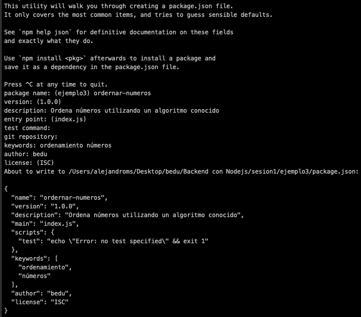

# Ejemplo 3

## Objetivo

Comprender el uso del archivo package.json, así como crear tu propio módulo

## Requerimientos

Tener instalado Nodejs y npm

## Desarrollo

### Package.json

Se considera este archivo como un manifesto de nuestro proyecto, donde se definen y se manejan características como nombre del proyecto, versión, repositorio, dependencias, autor, licencias, etc.

Se crea al iniciar un nuevo módulo con **npm**:

```bash
npm init
```

A continuación, nos pide configurar ciertas características respondiendo las preguntas que el asistente hace: 

- package name
- version
- description
- entry point
- test command
- git repository
- keywords
- author
- license

Y al final nos pide aceptar la configuración, después de esto se crea package.json. Aclarando, este archivo se puede crear manualmente únicamente con los siguientes campos: *name* y  *version*, pero mas adelante necesitaremos escribir los demás campos, la manera más práctica es iniciando npm.

Importante: El archivo **package.json** debe ser un **JSON** de formato válido esta implicación el siguiente link contiene la explicación y ejemplos de JSON que pueden aclarar tus dudas: [https://developer.mozilla.org/es/docs/Learn/JavaScript/Objects/JSON](https://developer.mozilla.org/es/docs/Learn/JavaScript/Objects/JSON)

De igual forma, cuando se necesita iniciar npm y no es necesario configurar package.json en ese momento podemos utilizar la bandera **-y** que hará la configuración por defecto y que más adelante podemos editar.

```bash
npm init -y
```

## Explicando los campos de package.json

### name

Es un campo obligatorio, la cadena representa el nombre del proyecto y es utilizado para formar un identificador junto a **version** en caso de ser publicado en npm. Entonces en caso de ser publicado se tiene que asegurar que no exista el nombre en npm.

### version

Es una cadena obligatoria que indica cuál es la versión más actual del proyecto definida por nosotros, para el versionamiento sigue la convencion **MAJOR.MINOR.PATCH**

### description

Es la cadena que indica lo que hace el proyecto creado

### keywords

Son palabras clave que tienen que ver con la descripción o intención del proyecto

### main

Es la cadena que indica el path del archivo principal del proyecto

### scripts

Es un objeto que indica comandos que podemos correr utilizando el proyecto creado, es utilizado aveces para correr el proyecto con varios entornos de desarrollado, o simplemente para evitar el uso de comandos que podemos olvidar a la hora de ejecutar el proyecto

### author

Es una cadena o un objeto con la información del creador del proyecto

### contributors

Es un arreglo de una cadena u objeto con la información de los colaboradores

### license

Es la cadena que especifica el tipo de licencia con que protegeremos el proyecto

### dependencies

Es un objeto que contiene los nombres y versiones de los paquetes instalados 

Para ver más detalles de cómo configurar **package.json** revisa el enlace, son campos más detallados que para está sesión no serán necesarios:

[](https://docs.npmjs.com/files/package.json)

## Creando un módulo propio

1. Crear una carpeta nueva Ej. ejemplo3/
2. Iniciar npm y configurar package.json

    ```bash
    npm init
    ```

    

3. Revisar que se haya creado **package.json** y asegurar que este los campos necesarios. Los campos mínimos para publicar un módulo en npm son: **name**, **version** y **main**

    La configuración actual es:

    ```json
    {
      "name": "ordernar-numeros",
      "version": "1.0.0",
      "description": "Ordena números utilizando un algoritmo conocido",
      "main": "index.js",
      "scripts": {
        "test": "echo \"Error: no test specified\" && exit 1"
      },
      "keywords": [
        "ordenamiento",
        "números"
      ],
      "author": "bedu",
      "license": "ISC"
    }
    ```

4. Crear el archivo **index.js** que como lo definimos es el archivo y creamos el siguiente código que corresponde al ordenamiento un arreglo utilizando el algoritmo *quicksort:*

    ```jsx
    function swap(items, leftIndex, rightIndex) {
      var temp = items[leftIndex];
      items[leftIndex] = items[rightIndex];
      items[rightIndex] = temp;
    }
    function partition(items, left, right) {
      var pivot = items[Math.floor((right + left) / 2)], //middle element
        i = left, //left pointer
        j = right; //right pointer
      while (i <= j) {
        while (items[i] < pivot) {
          i++;
        }
        while (items[j] > pivot) {
          j--;
        }
        if (i <= j) {
          swap(items, i, j); //sawpping two elements
          i++;
          j--;
        }
      }
      return i;
    }

    function quickSort(items, left, right) {
      var index;
      if (items.length > 1) {
        index = partition(items, left, right); //index returned from partition
        if (left < index - 1) {
          //more elements on the left side of the pivot
          quickSort(items, left, index - 1);
        }
        if (index < right) {
          //more elements on the right side of the pivot
          quickSort(items, index, right);
        }
      }
      return items;
    }

    module.exports = { quickSort }
    ```

    Basado en el código de: 

    [QuickSort Algorithm in JavaScript](https://www.guru99.com/quicksort-in-javascript.html)

5. Probar nuestro módulo:
    1. Crea un archivo **test.js** en el mismo directorio y copia el código

        ```jsx
        let ordenar = require('./index')
        let numeros = [7, 65, 1, 34, -1, 9, 46, 94]

        console.log(ordenar.quickSort(numeros, 0, numeros.length - 1));
        ```

    2. Ejecuta en terminal

        ```bash
        node test.js
        ```

        ```bash
        [-1,  1,  7,  9, 34, 46, 65, 94]
        ```