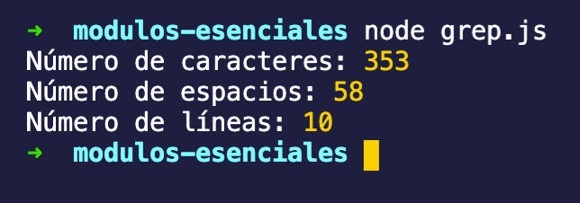

# Reto 01

1. Crea el archivo `input.txt` y copia y pega el texto que te genere el sitio [http://randomtextgenerator.com/](http://randomtextgenerator.com/)
2. Escribir un programa llamado `grep.js` que lea el archivo `input.txt`, lo procese e imprima por pantalla cuantas líneas, cuantos espacio y cuantos caracteres contiene el archivo. 

    Pista: Puedes iterar una cadena y utilizar el código ascii para comparar el valor numérico de un caracter. [https://theasciicode.com.ar/](https://theasciicode.com.ar/)

3. Pruébalo con el siguiente texto:

    ```
    Cartas a una desconocida

    Cuando pasen los años, cuando pasen
    Los años y el aire haya cavado un foso
    Entre tu alma y la mía; cuando pasen los años
    Y yo sólo sea un hombre que amó,
    Un ser que se detuvo un instante frente a tus labios,
    Un pobre hombre cansado de andar por los jardines,
    ¿Dónde estarás tú? !Dónde
    Estarás, oh hija de mis besos!
    ```

    La salida del programa debe ser cómo el siguiente:

    

    RESPUESTA PARA EXPERTO:

    ```jsx
    const fs = require('fs')
    const path = require('path')

    const data = fs.readFileSync(path.join(__dirname, '/ejemplo_1.txt'))
    console.log('Número de caracteres:', data.length);

    var numchars = 0, numlines = 1
    data.map(char => {
      if (char === 10)
        numlines++
      if (char === 32)
        numchars++
    })
    console.log('Número de espacios:', numchars);
    console.log('Número de líneas:', numlines);
    ```