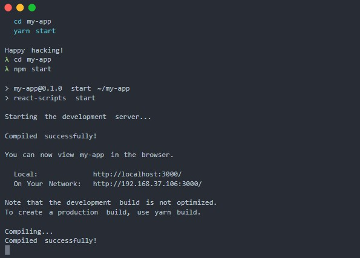

## Objetivo

Comprender las ventajas de las aplicaciones que se ejecutan desde la línea de comandos, también conocida como CLI (Command Line Interface). Aprender a utilizar algunas aplicaciones del entorno CLI que populares en el ecosistema NodeJS.

## Instrucciones

1. Hacer anotaciones o crear un mapa mental con los conceptos que consideres más importantes y quieras tener a la mano durante la sesión.
2. Opcionalmente puedes instalar las herramientas que aparecen al final siguiendo los pasos indicados en su respectiva documentación.

## Desarrollo

Antes de la popularización del mouse y de la metáfora del escritorio, los sistemas operativos contaban con únicamente la terminal (shell o línea de comandos) para recibir órdenes por medio de una pantalla y el teclado.

El desarrollo de aplicaciones para esta interfaz sigue siendo relevante, ya que la terminal es un entorno donde podemos recibir entradas y salidas de datos simples y de manera rápida cuándo ya tenemos memorizados ciertos atajos del teclado.

Si llevas tiempo desarrollando, ya sea frontend o backend, te habrás dado cuenta que muchos frameworks cuentan con herramientas y utilidades de línea de comandos para realizar rápidamente ciertas tareas cómo por ejemplo la inicialización de un nuevo proyecto de frontend en React o Angular. 

También para correr tareas automatizadas como es el caso de grunt, gulp y otros *tasks runners* que nos liberan de tener que realizar acciones  manuales y repetitivas una y otra vez.

Las ventajas de desarrollar y utilizar aplicaciones para la terminal son para los desarrolladores y personas con conocimientos avanzados. En el ecosistema npm encontrarás una gran variedad de librerías y plugins para crear aplicaciones, optimizar archivos, crear paquetes para llevar tu código a un entorno diferente, crear componentes web, hacer pruebas automatizadas, conectarte con servicios de terceros, etc...

Como puedes ver, el entorno CLI es un entorno para usuarios avanzados y desarrolladores. La manera más confiable de instalar una aplicación CLI y aprender a utilizarla es por medio de su documentación oficial.

Ahora puedes sumergirte y comenzar a utilizar algunos de estos proyectos CLI:

- **CFonts:** [https://github.com/dominikwilkowski/cfonts](https://github.com/dominikwilkowski/cfonts)

    

- Yeoman: [https://github.com/yeoman/yo](https://github.com/yeoman/yo) 
Yeoman te permite comenzar nuevos proyectos rápido creando un "esqueleto" de manera rápida

    [https://s3-us-west-2.amazonaws.com/secure.notion-static.com/1734de21-9dc0-40bb-b70a-ab33348125ac/9402f3aa7a3ac4c1cfcdafb0f15a57b3.webp](https://s3-us-west-2.amazonaws.com/secure.notion-static.com/1734de21-9dc0-40bb-b70a-ab33348125ac/9402f3aa7a3ac4c1cfcdafb0f15a57b3.webp)

- Angular CLI: [https://cli.angular.io/](https://cli.angular.io/)
- Create React App: [https://github.com/facebook/create-react-app](https://github.com/facebook/create-react-app)
- Vue CLI: [https://cli.vuejs.org/](https://cli.vuejs.org/)

## Conclusión

Teóricamente las posibilidades de una aplicación de línea de comandos son incontables*.* La interfaz puede llegar a ser la única limitación si se compara con una aplicación con interfaz gráfica, pero a la hora de hacer pruebas aisladas de las entradas y salidas que le daremos a nuestra aplicación tendremos estas limitaciones a nuestro favor.